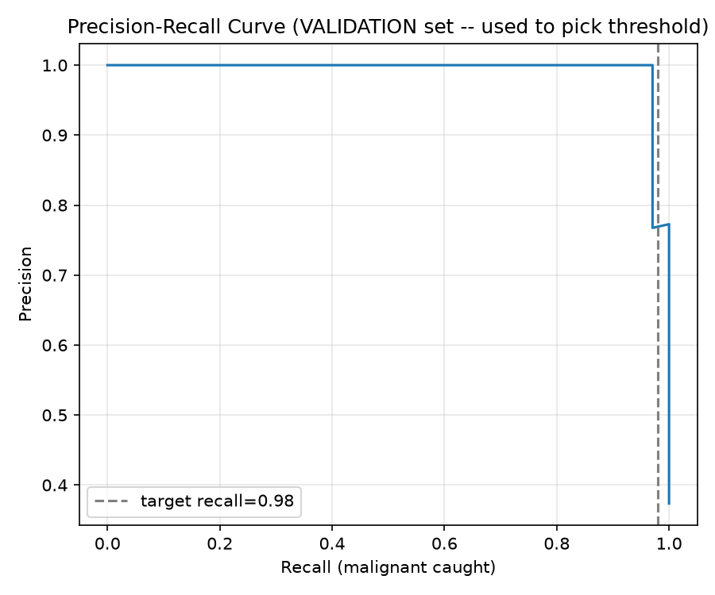
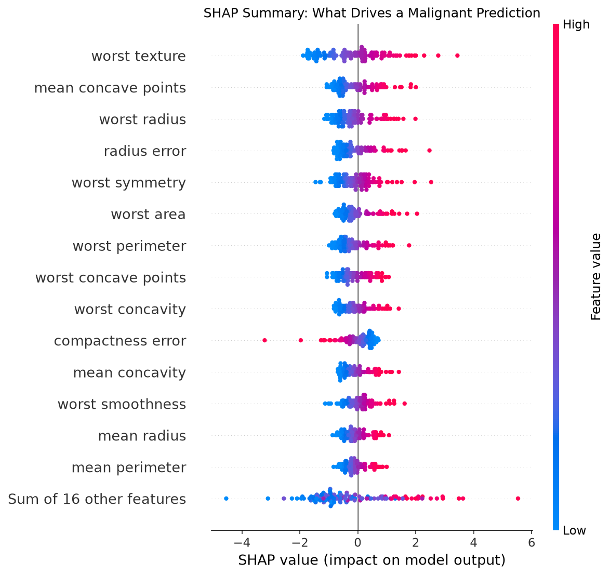

# Breast Mass Malignancy Risk Estimator

A machine learning project built around the questions that actually matter in
a screening context — which errors are worse, how confident is the model,
whether the "held-out" test set was actually held out, and whether a human
can understand why the model made a given call — rather than around chasing
an accuracy number on a dataset that's been solved since the 1990s.

> **This is a portfolio/educational project, not a medical device.** The
> Wisconsin Diagnostic Breast Cancer dataset (569 samples, one institution,
> one point in time) is not a basis for real diagnosis. The model has not
> been clinically validated and must never inform actual medical decisions.

## Honest framing

Binary classifiers on this dataset are one of the most common first ML
projects there is, and the dataset is close to linearly separable — any
reasonable method gets ~97%+ accuracy. That's not a hard problem, and no
amount of tooling on top changes that. What this repo demonstrates instead
is methodology: a first pass at this project had a real data-leakage bug
(described below, left in the history rather than hidden), and the value
here is in finding and fixing it, plus the surrounding practices — proper
splits, uncertainty quantification, a documented multicollinearity analysis,
tests, CI, and a deployable container — not in the underlying classification
task being difficult.

## The leakage bug, and why it mattered

An earlier version of this project selected its decision threshold by
sweeping a precision-recall curve computed **on the test set**, then reported
final metrics on that same test set. That's leakage: the test set was used
twice — once to make a decision, once to grade it — so the reported numbers
were optimistic. Concretely, the leaky version reported **100% recall** at
its tuned threshold.

The fix was a proper three-way split: threshold selection now happens on a
held-out **validation** set (91 patients, never used for training or
hyperparameter search); the **test** set (114 patients) is touched exactly
once, at the end, to report final numbers. With the fix in place, the same
kind of threshold-tuning exercise produces **97.6% recall** (95% CI:
92.1%–100%) at 87.2% precision — a real, more honest, number instead of an
artifact of tuning against the grading set. See `src/split_data.py` and
`src/evaluate.py`.

## Results




Three model families were tuned via `RandomizedSearchCV` with
`RepeatedStratifiedKFold` (5 folds × 3 repeats — a single 5-fold pass is
noisy on only 364 training rows) optimizing **average precision**, not raw
recall or accuracy. A pure-recall objective has a degenerate optimum (flag
everyone as malignant); average precision rewards ranking quality across the
whole precision/recall tradeoff and leaves the actual operating threshold as
a separate, later decision.

| Model | CV average precision (mean ± std) |
|---|---|
| **Logistic Regression (selected)** | **0.9937 ± 0.0072** |
| XGBoost | 0.9892 ± 0.0100 |
| Random Forest | 0.9872 ± 0.0099 |

Full details, including tuned hyperparameters, are in
`models/results_summary.json`.

### Threshold tuning and uncertainty

| Threshold | Recall | Precision | Recall 95% CI | Precision 95% CI |
|---|---|---|---|---|
| Default (0.5) | 97.6% | 97.6% | [92.1%, 100%] | [91.7%, 100%] |
| Tuned (0.174, chosen on validation) | 97.6% | 87.2% | [92.1%, 100%] | [76.9%, 96.1%] |

The tuned threshold was chosen on the validation set to target ≥98% recall,
then applied once to test. Confidence intervals are 2,000-resample bootstraps
of the 114-patient test set (only 42 malignant cases) — with a sample this
small, a bare point estimate like "100% recall" is fragile and overstates
confidence; the interval makes that explicit. See `models/eval_summary.json`,
`figures/precision_recall_curve_validation.png`, and
`figures/calibration_curve.png`.

### Multicollinearity (VIF analysis)

`src/feature_analysis.py` computes Variance Inflation Factors on the training
split only (never validation/test — using held-out data even for feature
selection would reintroduce a subtler version of the same leakage bug fixed
above). Several features are severely collinear: `mean radius` had a VIF of
**63,499** before pruning (`mean perimeter`, `mean area`, and `worst radius`
were similarly extreme), because radius/perimeter/area are nearly the same
physical quantity measured three ways.

Iteratively dropping the worst offender (VIF ≥ 10) down to 7 features costs a
real **−0.016 average precision** (0.9934 → 0.9775 in 5×3 CV) — more than a
0.01 tolerance, so the analysis's own decision rule keeps the full 30-feature
model rather than trading away that performance for interpretability. That
tradeoff, and the reasoning, is recorded in `models/vif_report.json` rather
than silently made. Practical consequence for the SHAP results below:
**attributions within a correlated feature cluster (radius/perimeter/area;
concavity/concave-points) should be read as "this cluster mattered," not as
precise credit to one specific feature** — for a linear model, SHAP values
are a direct function of coefficients that can shift between near-duplicate
correlated features without changing the prediction at all.

### What drives the model

Per SHAP (`LinearExplainer`, exact for this model), the strongest predictors
are `worst texture`, `mean concave points`, `worst radius`, `radius error`,
and `worst symmetry` — consistent with the clinical intuition that larger,
more irregular, less-uniform cell nuclei associate with malignancy, read with
the multicollinearity caveat above in mind. See `figures/shap_beeswarm.png`
and `models/shap_feature_ranking.json`.

## Engineering practices

- **Tests** (`tests/`, 15 passing): data integrity, split non-overlap and
  stratification, split reproducibility, model output shape/range,
  determinism, a trivial-baseline sanity check, and unit tests for the
  threshold-selection and bootstrap-CI logic itself.
- **CI** (`.github/workflows/ci.yml`): runs the full pipeline and test suite
  on every push, then builds the Docker image and smoke-tests that the
  container actually serves a healthy app — not just that it builds.
- **Config centralization** (`src/config.py`): every seed, split ratio, and
  search setting lives in one place instead of being copy-pasted (and
  silently drifting) across scripts.
- **Single source of truth for data** (`src/data.py`): one `make_splits()`
  function used by every downstream script, specifically so two scripts
  can't independently reconstruct "the same" split and quietly diverge —
  which is exactly how the original leakage bug happened.
- **Containerized** (`Dockerfile`): builds all data/model artifacts at image
  build time so the container is self-contained. *Caveat, stated plainly:*
  this was written and reviewed carefully but **could not be build-tested in
  the sandbox this project was developed in**, because that environment's
  network blocks all container registries. The CI docker-build job is the
  real verification — it runs on GitHub's infrastructure and will build and
  smoke-test the image on first push.

## Project structure

```
├── src/
│   ├── config.py            # central config: paths, seeds, ratios, search settings
│   ├── data.py               # load_raw, make_splits, load_splits -- single source of truth
│   ├── eda.py                 # exploratory analysis, class balance, correlations
│   ├── split_data.py          # creates + persists train/val/test (the leakage fix lives here)
│   ├── feature_analysis.py    # VIF multicollinearity analysis (train split only)
│   ├── train.py                # RepeatedStratifiedKFold + RandomizedSearchCV, avg-precision scoring
│   ├── evaluate.py             # threshold on val, final report + bootstrap CI on test (once)
│   └── shap_explain.py         # global + per-patient SHAP explanations
├── tests/
│   ├── test_data.py            # split correctness, stratification, reproducibility
│   └── test_pipeline.py        # model output contracts, threshold/CI logic
├── app/
│   └── app.py                   # Streamlit demo
├── .github/workflows/ci.yml     # test + docker-build-and-smoke-test on every push
├── Dockerfile
├── requirements.txt / requirements-dev.txt
├── data/ models/ figures/       # generated by the pipeline (not committed)
```

## Running it yourself

```bash
python3 -m venv venv && source venv/bin/activate
pip install -r requirements-dev.txt   # includes requirements.txt + pytest

python3 -m src.eda                # -> data/breast_cancer_full.csv, figures/*.png
python3 -m src.split_data         # -> data/train.csv, val.csv, test.csv (+ leak check)
python3 -m src.feature_analysis   # -> models/vif_report.json, selected_features.json
python3 -m src.train              # -> models/best_model.joblib, results_summary.json
python3 -m src.evaluate           # -> figures/*curve*.png, models/eval_summary.json
python3 -m src.shap_explain       # -> figures/shap_*.png

pytest tests/ -v                  # 15 tests

streamlit run app/app.py          # interactive demo, run from project root
```

Or with Docker (once you have registry access, e.g. in CI or on your own
machine): `docker build -t cancer-detection-app . && docker run -p 8501:8501 cancer-detection-app`.

## Data

[Wisconsin Diagnostic Breast Cancer dataset](https://archive.ics.uci.edu/dataset/17/breast+cancer+wisconsin+diagnostic)
(569 samples, 30 features computed from digitized images of fine needle
aspirates of breast masses), loaded via `sklearn.datasets.load_breast_cancer`.
No missing values. Class balance: 62.7% benign / 37.3% malignant.

**Note:** sklearn's built-in target encoding is `0=malignant, 1=benign`, the
reverse of the usual "positive class = disease present" medical ML
convention. This project remaps it (`1=malignant, 0=benign`) in exactly one
place (`src/data.py::load_raw`) — getting this backwards is a common mistake
that silently inverts the meaning of every precision/recall number
downstream, and a test (`test_target_convention_matches_known_class_balance`)
exists specifically to catch it if it regresses.

## Model card (abbreviated)

**Intended use:** educational demonstration of an ML methodology pipeline —
correct evaluation for an asymmetric-cost classification problem, leakage
prevention, uncertainty quantification, and explainability. Suitable as a
portfolio artifact and a base for learning, not as a component of any
real diagnostic workflow.

**Out-of-scope use:** any real clinical decision-making, patient-facing
deployment, or use as a diagnostic aid, screening tool, or second opinion.

**Training data:** single-institution, single-timepoint, 569 samples, no
demographic information available for subgroup analysis. No external
validation cohort.

**Ethical considerations:** the model has not been assessed for performance
across demographic subgroups (the dataset provides no such labels to assess
against), has not been compared against a clinical baseline (e.g. pathologist
concordance), and reflects only cell-morphology features from one imaging
protocol.

## Limitations

- 569 samples total (364 train / 91 validation / 114 test) is small; a
  91-patient validation set and 114-patient (42-malignant) test set produce
  real sampling noise, reflected in the bootstrap CIs above rather than
  hidden behind point estimates.
- No external validation set from a different institution or population.
- Cell-morphology features only, not a full pathology workup.
- The VIF analysis found real multicollinearity that the deployed model does
  not correct for, with a documented, quantified reason why (see above).
- Docker image is written to standard practice but unverified in a build
  environment as of this commit — see the CI caveat above.

## Possible next steps

- Move from tabular features to raw histopathology images (e.g. BreakHis or
  PatchCamelyon datasets) with a CNN/transfer-learning approach.
- Add data/model versioning (DVC) and experiment tracking (MLflow/W&B) so
  the single `results_summary.json` isn't overwritten by the next run.
- Deploy behind a FastAPI inference endpoint with request logging and basic
  drift monitoring, in addition to the Streamlit demo.
- Explore an LLM/RAG layer over medical literature (e.g. PubMed abstracts)
  as a complementary, distinct project.
